

    
   
 

## Descrição do desafio módulo – Processamento de Dados Simplificado com Power BI
1. Criação de uma instância na Azure para MySQL
    

    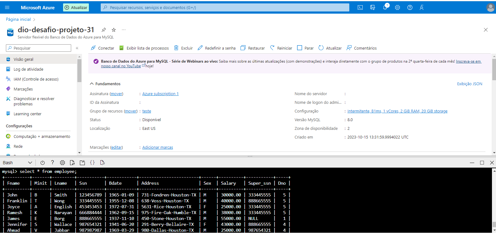

    

1. Criar o Banco de dados com base disponível no github
    

    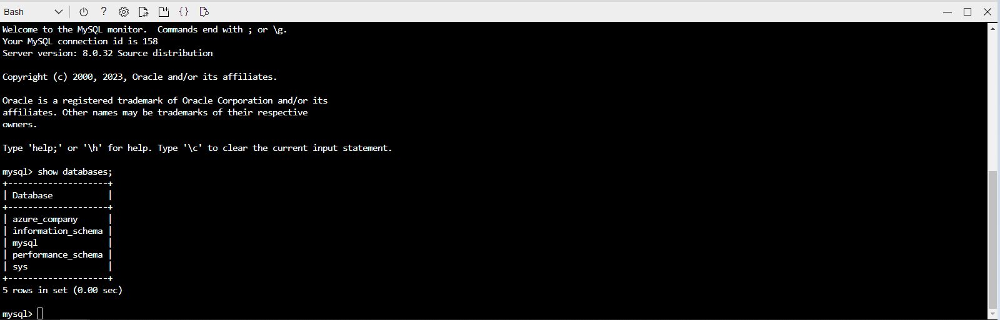

    

1. Integração do Power BI com MySQL no Azure 
    

    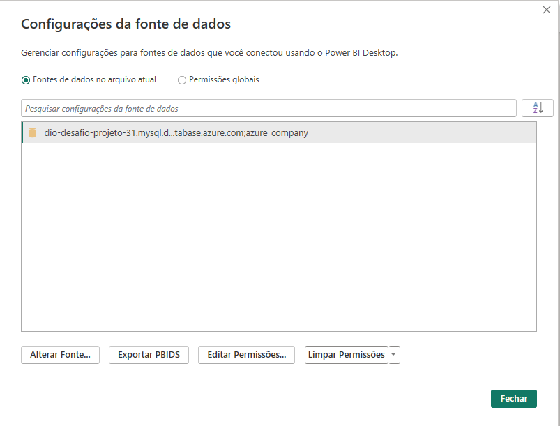

    

1. Verificar problemas na base a fim de realizar a transformação dos dados
Diretrizes para transformação dos dados
    

    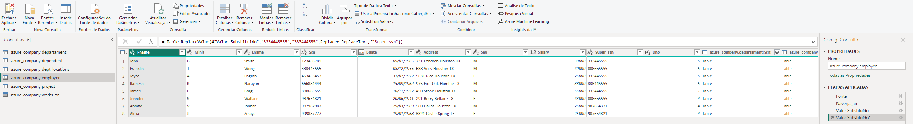

    

1. Verifique os cabeçalhos e tipos de dados    
    

    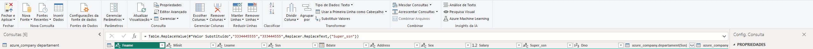

    

1. Modifique os valores monetários para o tipo double preciso
    

    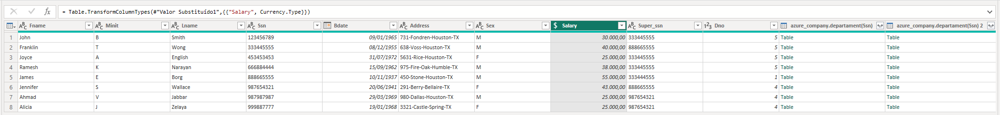

    

1. Verifique a existência dos nulos e analise a remoção
    

    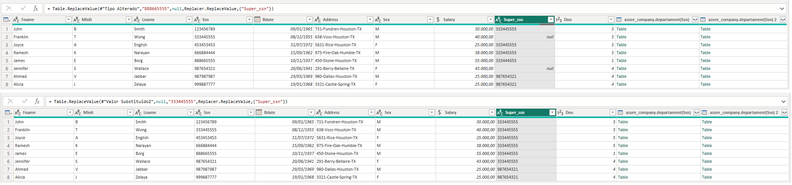

    
   
    
1. Os employees com nulos em Super_ssn podem ser os gerentes. Verifique se há algum colaborador sem gerente
    

    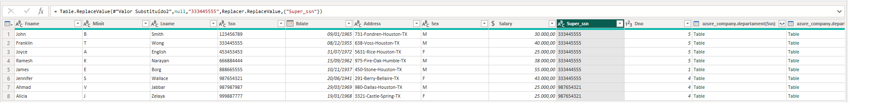

    

1. Verifique se há algum departamento sem gerente
    

    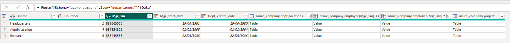

    

1. Se houver departamento sem gerente, suponha que você possui os dados e preencha as lacunas
    

    

    

1. Verifique o número de horas dos projetos
    

    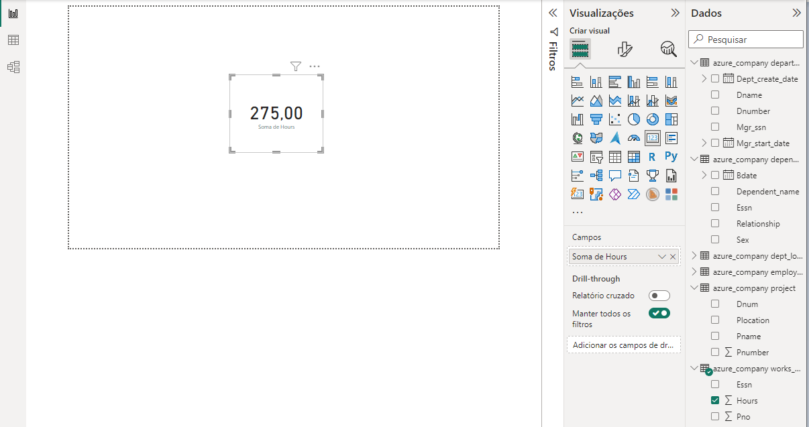

    
 

1. Separar colunas complexas
    

    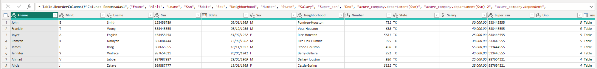

    
 

1. Mesclar consultas employee e departament para criar uma tabela employee com o nome dos departamentos associados aos colaboradores. A mescla terá como base a tabela employee. Fique atento, essa informação influencia no tipo de junção
    

    

    
 
1. Neste processo elimine as colunas desnecessárias. 
     

    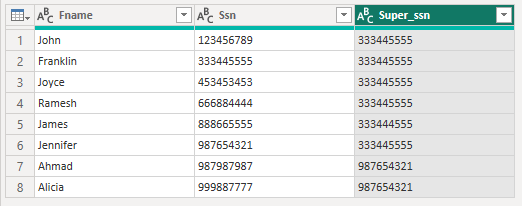

    
 

1. Realize a junção dos colaboradores e respectivos nomes dos gerentes . Isso pode ser feito com consulta SQL ou pela mescla de tabelas com Power BI. Caso utilize SQL, especifique no README a query utilizada no processo.
    

    

    
 
1. Mescle as colunas de Nome e Sobrenome para ter apenas uma coluna definindo os nomes dos colaboradores
    

    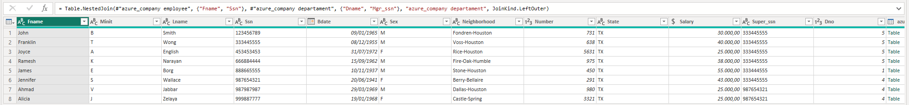

    
 
1. Mescle os nomes de departamentos e localização. Isso fará que cada combinação departamento-local seja único. Isso irá auxiliar na criação do modelo estrela em um módulo futuro.
    

    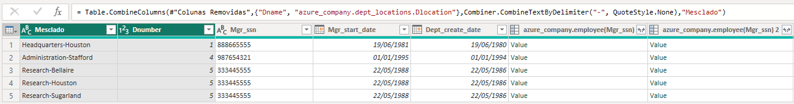

    
 
1. Explique por que, neste caso supracitado, podemos apenas utilizar o mesclar e não o atribuir. 
- A diferença basica entre mesclar e atribuir esta na forma que eles relacionam as colunas, este trata as linhas e outro as colunas. 

1. Agrupe os dados a fim de saber quantos colaboradores existem por gerente
    

    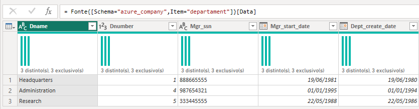

    
 

1. Elimine as colunas desnecessárias, que não serão usadas no relatório, de cada tabela

    

    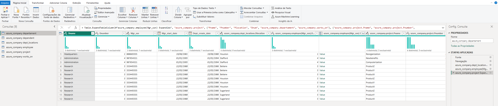

    
 