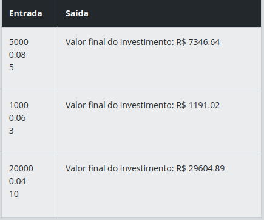

## Desafio

Imagine que você está desenvolvendo um aplicativo para um banco que deseja calcular os juros compostos de um investimento. Seu objetivo é criar uma função que receba três parâmetros: o valor inicial do investimento, a taxa de juros anual e o período de tempo em anos. A função deve calcular e retornar o valor final do investimento após o período determinado, levando em consideração os juros compostos.
### Entrada:

A função deve receber os seguintes parâmetros:

valor_inicial: um número inteiro ou decimal representando o valor inicial do investimento.

taxa_juros: um número decimal representando a taxa de juros anual. Por exemplo, se a taxa for de 5%, o valor passado será 0.05.

periodo: um número inteiro representando a quantidade de anos do investimento.
### Saída:

A função deve retornar o valor final do investimento após o período determinado, considerando os juros compostos. O valor final deve ser arredondado para duas casas decimais.
Exemplos

A tabela abaixo apresenta exemplos com alguns dados de entrada e suas respectivas saídas esperadas. Certifique-se de testar seu programa com esses exemplos e com outros casos possíveis.

