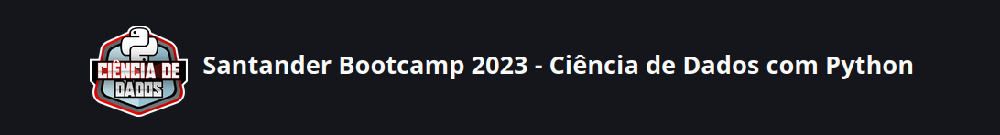

# Dio-Desenvolvimento-Java-AWS

## Bem-vindo ao repositório do Projeto Santander Bootcamp 2023 - Ciência de Dados com Python, oferecido pela Dio - Digital Innovation one

### Sobre o Projeto
Neste repositório deixarei minhas experiencias nessa jornada e espero por sua contribuição, seja com criticas e sujestões! 

### Como Contribuir

Sua contribuição é muito bem-vinda! Se você um novo programador ou um veterano experiente, há espaço para todos aqui. Aqui estão algumas maneiras pelas quais você pode contribuir:

- **Adicione Recursos:** Se você encontrar um tutorial, artigo ou recurso útil relacionado ao curso, sinta-se à vontade para compartilhá-lo.
- **Compartilhe Experiências:** Compartilhe seus conhecimentos e experiências . Discutir desafios e soluções pode ser incrivelmente enriquecedor para todos os envolvidos. 

Agradeço por se juntar nesta jornada de aprendizado e criação.  